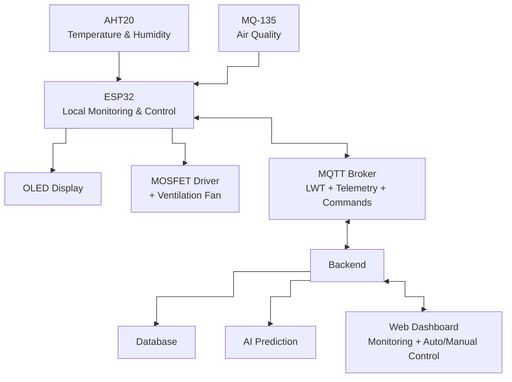

# Smart Indoor Environment Monitoring and Climate Control System

## 📌 Overview

An end-to-end Internet of Things (IoT) system designed to monitor kitchen environmental conditions and automate ventilation. The system utilizes an ESP32 microcontroller, AHT20 temperature and humidity sensor, and MQ-135 air-quality sensor to collect environmental data. This data is displayed locally on a 1.3-inch Organic Light-Emitting Diode (OLED) screen and transmitted via Message Queuing Telemetry Transport (MQTT) to a backend and web dashboard.

The project supports real-time monitoring, historical data visualization, multi-variable control logic, safe local operation during network failures, automatic network recovery, and AI-based environmental prediction.

## 💡 Motivation

Kitchen environments experience rapid changes in temperature, humidity, and air quality during cooking, directly impacting indoor comfort and safety. This project serves as a practical smart home prototype, integrating embedded systems, IoT networking, backend architecture, web development, and intelligent control algorithms to address a real-world problem.

## ✨ Key Features

* **Real-Time Monitoring:** Continuous tracking of temperature, humidity, and air quality.
* **Local Display:** Live environmental data displayed on a 1.3-inch OLED screen.
* **MQTT Telemetry:** Structured payloads with device ID, timestamps, justified Quality of Service (QoS), and Last Will and Testament (LWT) for online/offline device status tracking.
* **Web Dashboard:** Real-time status, historical plots, data freshness indicators, actuator states, and alarm notifications.
* **Advanced Control Logic:** Multi-variable environmental control combining temperature, humidity, and air-quality measurements to trigger physical ventilation.
* **Anti-Chattering Protection:** Implements hysteresis, minimum switching time, and/or state-machine logic to prevent unnecessary fan switching.
* **Safe Local Operation:** Autonomous sensor monitoring and ventilation control continue locally even during Wi-Fi, MQTT broker, or backend outages.
* **Automatic Network Recovery:** Automatic Wi-Fi and MQTT reconnection after communication interruptions.
* **Sensor Calibration:** Raw Analog-to-Digital Converter (ADC) values are calibrated and sanity-checked before being used as final measurements.
* **AI-Based Prediction:** Historical sensor data is analyzed using Artificial Intelligence (AI) to predict environmental trends and fluctuations.

## 🖼️ System Architecture

## 🔌 Hardware Setup

| Component     | Function                            | Interface       |
| ------------- | ----------------------------------- | --------------- |
| ESP32         | Main Microcontroller Unit (MCU)     | Main Controller |
| AHT20         | Temperature and Humidity Monitoring | I2C             |
| MQ-135        | Air-Quality Monitoring              | Analog / ADC    |
| OLED 1.3"     | Local Environmental Data Display    | I2C             |
| MOSFET Driver | Ventilation Fan Control             | GPIO            |
| DC Fan        | Physical Ventilation Actuator       | MOSFET Output   |

## 🛠️ Technologies and Tools

### Programming Languages

* **C/C++** — ESP32 firmware and embedded programming.
* **JavaScript** — Backend and web application development.
* **Python** — AI, data analysis, and environmental prediction.
* **HTML/CSS** — Web user interface development.
* **LaTeX** — Final technical report.

### Technologies

* **ESP32** — IoT microcontroller platform.
* **MQTT** — IoT communication protocol.
* **REST API (Representational State Transfer Application Programming Interface)** — Backend-to-web communication.
* **Database** — Historical environmental data storage.
* **Artificial Intelligence / Machine Learning** — Environmental trend prediction.

### Development Tools

* Arduino IDE
* Visual Studio Code
* Git and GitHub
* MQTT Broker
* KiCad
* Overleaf / LaTeX

## 🎯 Project Goal

The goal of this project is to build a complete and reproducible **End-to-End IoT system** integrating:

> **Embedded Systems + IoT + MQTT + Backend + Database + Web Dashboard + Automatic Control + AI**

The system connects real environmental sensors and physical actuators with backend services and a web application to provide reliable monitoring, intelligent multi-variable control, automatic ventilation, safe local operation, and AI-based environmental prediction.
